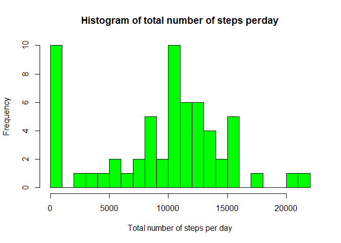
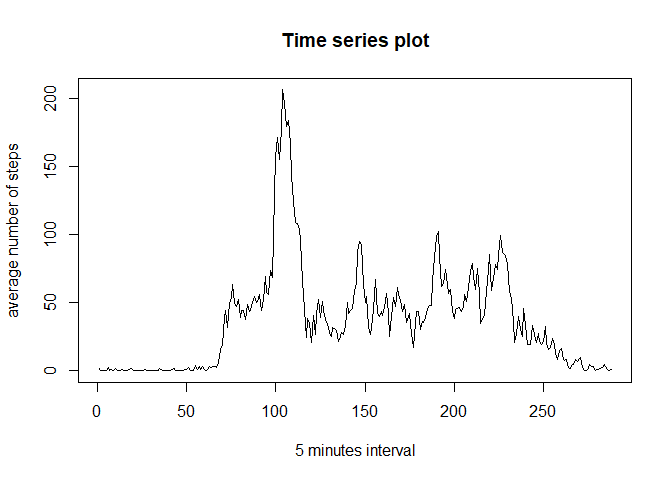
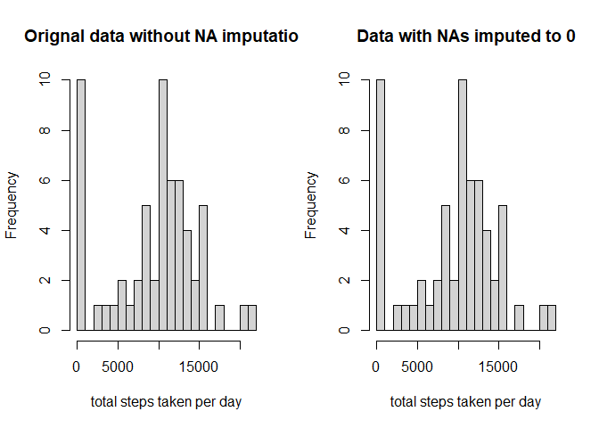
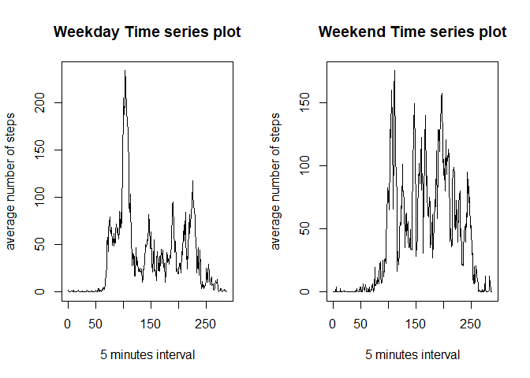

---
output:
  html_document: 
    keep_md: yes
  pdf_document: default
  Keep_md: true
---
# Reproducible Research

## Loading and Processing the data

### 1. Downloading and loading the data into R workspace.


```r
activitydata <- read.csv("activity.csv", header = T)

dim(activitydata)
```

```
## [1] 17568     3
```

```r
head(activitydata)
```

```
##   steps       date interval
## 1    NA 2012-10-01        0
## 2    NA 2012-10-01        5
## 3    NA 2012-10-01       10
## 4    NA 2012-10-01       15
## 5    NA 2012-10-01       20
## 6    NA 2012-10-01       25
```

```r
str(activitydata)
```

```
## 'data.frame':	17568 obs. of  3 variables:
##  $ steps   : int  NA NA NA NA NA NA NA NA NA NA ...
##  $ date    : chr  "2012-10-01" "2012-10-01" "2012-10-01" "2012-10-01" ...
##  $ interval: int  0 5 10 15 20 25 30 35 40 45 ...
```

```r
activitydatacopy <- activitydata
```

This shows that the date coulmn of our data is not in date format, so we have to convert it to the date format.


```r
activitydata$date <- as.Date(activitydata$date, "%Y-%m-%d")
```
Now the data is loaded and processed for our analysis.

### 2. What is mean total number of steps taken per day and the Histogram represntation.

Code for calculating the total number of steps per day.


```r
aggregatesteps <- tapply(activitydata$steps, activitydata$date, FUN = sum, na.rm = T)
hist(aggregatesteps, breaks = 19, main = "Histogram of total number of steps perday", xlab = "Total number of steps per day", col = "green")
```

<!-- -->

### 3. Code for calculating the mean and median of the total number of steps taken per day.


```r
meansteps <- mean(aggregatesteps)
print(meansteps)
```

```
## [1] 9354.23
```

```r
mediansteps <- median(aggregatesteps)
print(mediansteps)
```

```
## [1] 10395
```

### 4. Time series plot of the average number of steps taken.


```r
avgsteps_perday <- tapply(activitydata$steps, activitydata$interval, FUN = mean, na.rm = T)
plot(avgsteps_perday, type = "l", ylab = "average number of steps", xlab = "5 minutes interval", main = "Time series plot")
```

<!-- -->

### 5. The 5-minute interval that, on average, contains the maximum number of steps


```r
avgsteps_perday[which.max(avgsteps_perday)]
```

```
##      835 
## 206.1698
```
### 6. Code to describe and show a strategy for imputing missing data.
Stategy used: Replacing the NAs with integer 0.


```r
activitydata1 <- activitydata ## A copy of the orignal data is made so as to make two histograms with orignal and imputed NAs for comparision.

activitydata1$steps[is.na(activitydata1$steps)] <- 0

head(activitydata1, 20) ## To check whether this worked or not.
```

```
##    steps       date interval
## 1      0 2012-10-01        0
## 2      0 2012-10-01        5
## 3      0 2012-10-01       10
## 4      0 2012-10-01       15
## 5      0 2012-10-01       20
## 6      0 2012-10-01       25
## 7      0 2012-10-01       30
## 8      0 2012-10-01       35
## 9      0 2012-10-01       40
## 10     0 2012-10-01       45
## 11     0 2012-10-01       50
## 12     0 2012-10-01       55
## 13     0 2012-10-01      100
## 14     0 2012-10-01      105
## 15     0 2012-10-01      110
## 16     0 2012-10-01      115
## 17     0 2012-10-01      120
## 18     0 2012-10-01      125
## 19     0 2012-10-01      130
## 20     0 2012-10-01      135
```

### 7. Histogram of the total number of steps taken each day after missing values are imputed.


```r
aggregatesteps <- tapply(activitydata$steps, activitydata$date, FUN = sum, na.rm = T) ## This is the orignal data frame with NAs.


aggregatesteps1 <- tapply(activitydata1$steps, activitydata1$date, FUN = sum) ## Notice here that I have not used the na.rm argument since I am using the data frame whose NAs are imputed to zero.


par(mfrow = c(1, 2))

hist(aggregatesteps, breaks=19, main = "Orignal data without NA imputation", xlab = "total steps taken per day")

hist(aggregatesteps1, breaks=19, main = "Data with NAs imputed to 0", xlab = "total steps taken per day")
```

<!-- -->
### 8. Panel plot comparing the average number of steps taken per 5-minute interval across weekdays and weekends.

For this, first I have to subset my original data into weekdays and weekends.


```r
# Converting the dates in the actual data to Weekdays and then subset into weekdays and weekends.

activitydatacopy$day <- strftime(activitydatacopy$date, "%A") # Now the data has names of weekdays instead of dates.

activityweekday <- activitydatacopy[activitydatacopy$day %in% c("Monday", "Tuesday", "Wednesday", "Thursday", "Friday"), ]

activityweekend <-  activitydatacopy[activitydatacopy$day %in% c("Saturday", "Sunday"), ]
```

###  Ploting the panel graph for the two subsets.


```r
dim(activityweekday)
```

```
## [1] 12960     4
```

```r
dim(activityweekend)
```

```
## [1] 4608    4
```

```r
# This is just to check that my subsets are correct.

weekdayavg <- tapply(activityweekday$steps, activityweekday$interval, FUN = mean, na.rm = T)

weekendavg <- tapply(activityweekend$steps, activityweekend$interval, FUN = mean, na.rm = T)

par(mfrow = c(1, 2))

plot(weekdayavg, type = "l", ylab = "average number of steps", xlab = "5 minutes interval", main = "Weekday Time series plot")

plot(weekendavg, type = "l", ylab = "average number of steps", xlab = "5 minutes interval", main = "Weekend Time series plot")
```

<!-- -->


### 9. All of the R code needed to reproduce the results (numbers, plots, etc.) in the report.


